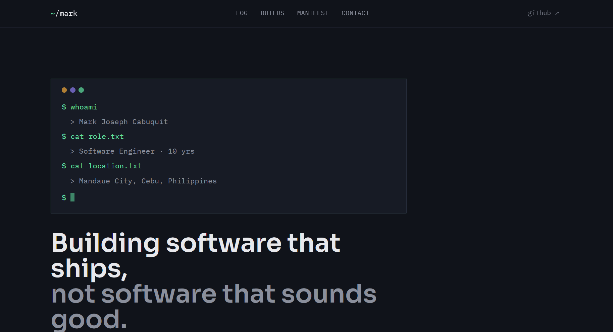

# Mark Joseph Cabuquit — Portfolio



My personal portfolio, built as a "changelog" that frames my career as versioned software releases (v1.0.0 → v1.2.0).

**Live:** https://mjcabuquit-porfolio-flame-zeta.vercel.app

## Stack
- React + TypeScript
- Vite
- Deployed on Vercel

## Highlights
- Changelog-style career timeline
- Typed terminal boot sequence hero
- Dark theme with IBM Plex Sans/Mono and Sora

## Run locally
```bash
npm install
npm run dev
```

## Notes
Early on, `node_modules` got committed without a `.gitignore`, which broke the Vercel deploy. I untracked it and pinned the framework to Vite in `vercel.json`.
